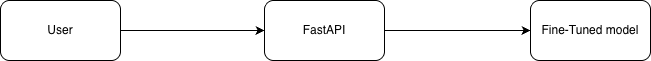

# 🚀 Custom SME AI Agents (Mistral & Llama 3)

Engineering 3 differents custom AI Agents for SME use cases (proofreading, domain-specific translation)

Deploying memory-efficient, fine-tuned LLMs for Small and Medium Enterprises (SMEs) to automate proofreading and domain-specific translation.


## 📖 Overview
This project demonstrates a complete end-to-end pipeline for fine-tuning open-weights models (**Mistral 7B / Llama 3**) and deploying them as a scalable API. 

**Key Achievements:**
* **Memory Efficiency:** Utilized **LoRA (Low-Rank Adaptation)** and 4-bit quantization to fine-tune models on consumer-grade hardware.
* **Accuracy:** Still improving for domain-specific tasks.
* **Production:** Packaged the inference engine into a Dockerized **FastAPI** microservice.

## 🏗️ System Architecture

   

## 📂 Project Structure

```text
ai-agents-sme/
├── app/
│   ├── main.py             # Point d'entrée FastAPI
│   ├── api/
│   │   └── routes.py       # Endpoints API (upload, process)
│   ├── core/
│   │   ├── config.py       # Configuration (clés API, chemins)
│   │   └── inference.py    # Logique d'inférence (LoRA + Modèle de base)
│   ├── models/             # Modèles LoRA fine-tunés
│   │   └── lora_magazine_X/
│   └── prompts/
│       └── templates.py    # Domain-specific prompt engineering
│   ├── static/             # Rapports PDF générés
│   └── utils/
│       ├── extract_text_utils.py   # Extraction de texte (PDF/Docx)
│       └── report_utils.py # Génération de rapports
├── scripts/
│   ├── train_lora.py       # Script de fine-tuning LoRA
│   └── generate_data.py    # Génération de données synthétiques
├── assets/                 # Diagrames d'architecture
├── Dockerfile              # Conteneurisation
├── docker-compose.yml      # Orchestration Docker
├── requirements.txt        # Dépendances Python
├── config.template.yaml    # Template de configuration
└── README.md
```

## ⚙️ How to Run (Quickstart)

1. **Clone the repository:**
   ```bash
   git clone [https://github.com/Leandredt/ai-agents-sme.git](https://github.com/Leandredt/ai-agents-sme.git)
   cd ai-agents-sme